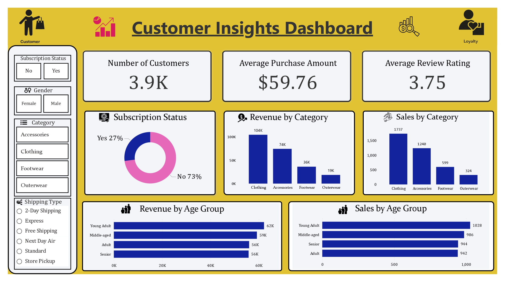

# Customer Insights Dashboard

## Dashboard Preview

<p align="center">
  
</p>

## Project Overview

The **Customer Insights Dashboard** project focuses on analyzing customer shopping behavior using **Python**, **SQL**, and **Power BI** to derive actionable business insights. The project demonstrates end-to-end data handling: raw data ingestion, data cleaning, exploratory data analysis, SQL-based analysis, and interactive dashboard visualization.

This repository is designed to showcase practical skills in **data analysis**, **business intelligence**, and **data-driven decision-making**, making it suitable for recruiters, hiring managers, and ATS (Applicant Tracking Systems).

---

## Objectives

* Analyze customer demographics and purchasing patterns
* Identify high-value customers and popular product categories
* Understand spending behavior across age groups and genders
* Build an interactive Power BI dashboard for business reporting
* Demonstrate hands-on skills in Python, SQL, and data visualization

---

## Dataset

* **Source:** Kaggle (Customer Shopping Behavior dataset)
* **File:** `customer_shopping_behavior_kaggle.csv`

### Key Attributes

* Customer ID
* Age and Age Group
* Gender
* Product Category
* Item Purchased
* Purchase Amount
* Review Rating
* Payment Method
* Shopping Frequency

---

## Dataset Glossary (Column-wise)

* **Customer ID** – Unique identifier for each customer
* **Age** – Age of the customer
* **Gender** – Gender of the customer (Male/Female)
* **Item Purchased** – The item purchased by the customer
* **Category** – Category of the item purchased
* **Purchase Amount (USD)** – Purchase amount in USD
* **Location** – Location where the purchase was made
* **Size** – Size of the purchased item
* **Color** – Color of the purchased item
* **Season** – Season during which the purchase was made
* **Review Rating** – Rating given by the customer
* **Subscription Status** – Indicates whether the customer has an active subscription (Yes/No)
* **Shipping Type** – Type of shipping selected by the customer
* **Discount Applied** – Indicates whether a discount was applied (Yes/No)
* **Promo Code Used** – Indicates whether a promo code was used (Yes/No)
* **Previous Purchases** – Total number of previous completed purchases by the customer
* **Payment Method** – Customer’s preferred payment method
* **Frequency of Purchases** – How often the customer makes purchases (Weekly, Fortnightly, Monthly)

---

## Tools and Technologies

* **Programming Language:** Python
* **Libraries:** Pandas, NumPy, Matplotlib, Seaborn
* **Database:** MySQL (SQL queries for analysis)
* **Visualization Tool:** Power BI
* **Environment:** Jupyter Notebook

---

## Project Structure

```
Customer-Insights-Dashboard/
│
├── customer_shopping_behavior_kaggle.csv   # Raw dataset
├── customer_shopping_behaviour_python.ipynb # Python analysis notebook
├── customer_behavior_sql_queries.sql        # SQL queries for insights
├── customer_insights_dashboard.pbix         # Power BI dashboard file
└── README.md                                # Project documentation
```

---

## Data Analysis Workflow

### 1. Data Cleaning and Preparation (Python)

* Handled missing and inconsistent values
* Created age groups for demographic analysis
* Standardized categorical variables
* Verified data types and integrity

### 2. Exploratory Data Analysis (EDA)

* Customer distribution by age group and gender
* Purchase trends across product categories
* Spending patterns and average purchase value
* Review ratings and customer satisfaction analysis

### 3. SQL-Based Analysis

* Customer segmentation queries
* Category-wise revenue analysis
* High-value customer identification
* Purchase frequency analysis

(SQL queries are available in `customer_behavior_sql_queries.sql`)

### 4. Power BI Dashboard

* Interactive slicers for gender, age group, and category
* KPIs for total sales, average purchase value, and customer count
* Visuals for trends, distributions, and comparisons
* Business-ready dashboard for decision support

---

## Key Insights

* Certain age groups contribute higher average purchase values
* Specific product categories dominate overall revenue
* Repeat customers show higher spending consistency
* Payment method preferences vary by demographic segment

---

## Skills Demonstrated

* Data Cleaning and Preprocessing
* Exploratory Data Analysis (EDA)
* SQL Query Writing and Optimization
* Business Intelligence and Dashboard Design
* Analytical Thinking and Insight Generation

---

## How to Use This Project

1. Clone the repository
2. Open the Jupyter Notebook to review Python-based analysis
3. Import the CSV file into MySQL to execute SQL queries
4. Open the `.pbix` file in Power BI Desktop to explore the dashboard

---

## Use Cases

* Customer behavior analysis
* Sales and marketing strategy planning
* Business performance reporting
* Portfolio project for Data Analyst / Business Analyst roles

---

## Author

**Ingale Yash Satish**
Aspiring Data Analyst
Skills: Python, SQL, Power BI, Data Analysis, Data Visualization

---

## License

This project is for educational and portfolio purposes.
